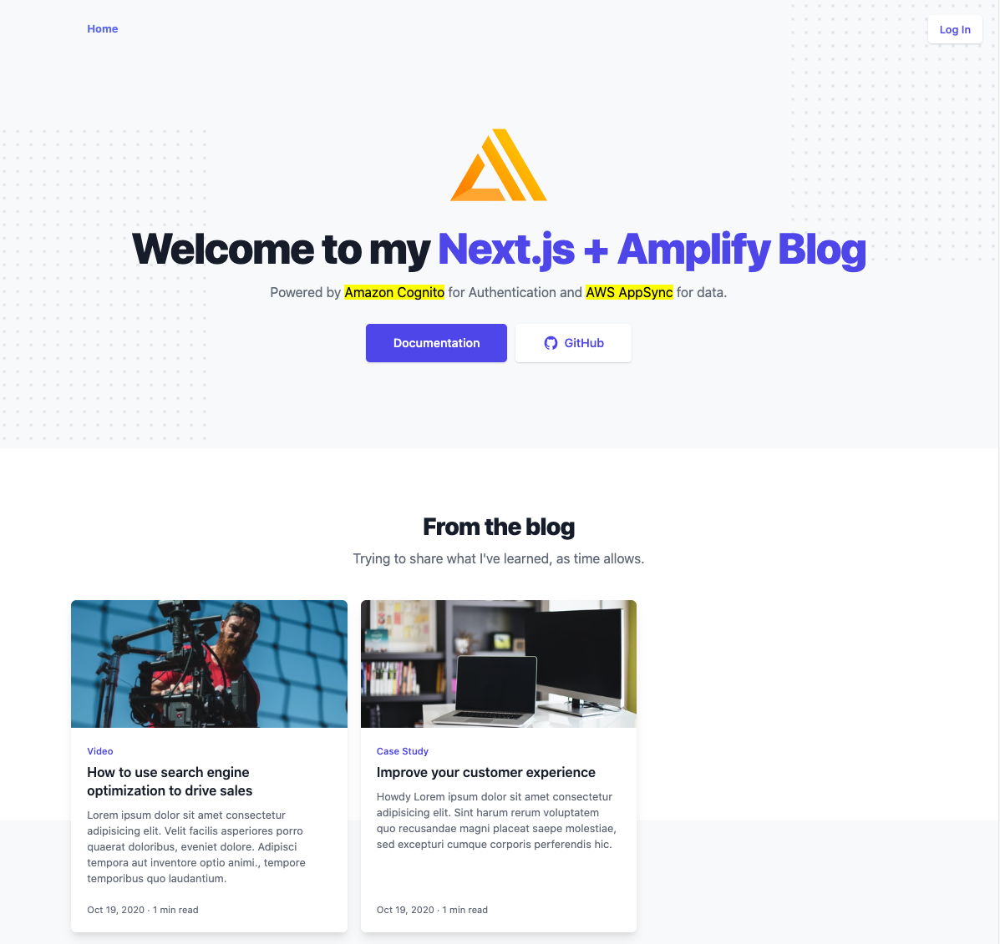

# From Front-end to Full Stack – Next.js Conf 2020

> This project demonstrates the architecture changes Amplify JS needed to support Next.js,
> authentication & data-access in a client-side application,
> and how to move logic to the server for better performance.



## Setup

1. Clone this repo

   ```shell
   git clone git@github.com:ericclemmons/next.js-conf-2020.git
   ```

1. Change into the directory & install the dependencies

   ```shell
   cd next.js-conf-2020

   yarn install
   ```

1. **Next, choose your own adventure:**:

   1. You can either continue with the [`main`](https://github.com/ericclemmons/next.js-conf-2020/tree/main) branch & setup Amplify from scratch (e.g. `amplify init`, `amplify add auth`, `amplify add api`).
   1. Or, you can checkout the [`live-demo`](https://github.com/ericclemmons/next.js-conf-2020/tree/live-demo) branch and re-use the backend configuration from the presentation.

## New Backend ([`main`](https://github.com/ericclemmons/next.js-conf-2020/tree/main))

1. Initialize Amplify

   ```shell
   amplify init
   ```

   <details>
   <summary>
   More details&hellip;
   </summary>

   ```console
   $ amplify init
   ? Enter a name for the project nextjsconf2020
   ? Enter a name for the environment dev
   ? Choose your default editor: Visual Studio Code
   ? Choose the type of app that you're building javascript
   Please tell us about your project
   ? What javascript framework are you using react
   ? Source Directory Path:  src
   ? Distribution Directory Path: build
   ? Build Command:  npm run-script build
   ? Start Command: npm run-script start
   ```

   </details>

1. Add Authentication

   ```shell
   amplify add auth
   ```

   <details>
   <summary>
   More details&hellip;
   </summary>

   ```console
   $ amplify add auth
   Do you want to use the default authentication and security configuration? Default configuration
   Warning: you will not be able to edit these selections.
   How do you want users to be able to sign in? Username
   Do you want to configure advanced settings? No, I am done.
   ```

   </details>

1. Add API

   ```shell
   amplify add api
   ```

   <details>
   <summary>
   More details&hellip;
   </summary>

   ```console
   $ amplify add api
   ? Please select from one of the below mentioned services: GraphQL
   ? Provide API name: nextjsconf2020
   ? Choose the default authorization type for the API API key
   ? Enter a description for the API key:
   ? After how many days from now the API key should expire (1-365): 7
   ? Do you want to configure advanced settings for the GraphQL API Yes, I want to make some additional changes.
   ? Configure additional auth types? Yes
   ? Choose the additional authorization types you want to configure for the API Amazon Cognito User Pool
   Cognito UserPool configuration
   Use a Cognito user pool configured as a part of this project.
   ? Configure conflict detection? No
   ? Do you have an annotated GraphQL schema? No
   ? Choose a schema template: Single object with fields (e.g., “Todo” with ID, name, description)
   ```

   </details>

   Next, you'll be prompted to edit your schema:

   > ? Do you want to edit the schema now? **Yes**

   Replace the contents of your editor with the following, then save:

   ```gql
   type Post
     @model
     # See: https://docs.amplify.aws/cli/graphql-transformer/directives#owner-authorization
     @auth(rules: [{ allow: owner }, { allow: public, operations: [read] }])
     # See: https://docs.amplify.aws/cli/graphql-transformer/directives#how-to-use-key
     @key(name: "postsBySlug", fields: ["slug"], queryField: "postsBySlug") {
     id: ID!
     title: String!
     slug: String!
     tags: [String!]!
     snippet: String!
     content: String!
     published: Boolean!
   }
   ```

1. Deploy your backend to the cloud

   ```shell
   amplify push
   ```

   <details>
   <summary>
   More details&hellip;
   </summary>

   ```console
   ? Do you want to generate code for your newly created GraphQL API Yes
   ? Choose the code generation language target javascript
   ? Enter the file name pattern of graphql queries, mutations and subscriptions src/graphql/**/*.js
   ? Do you want to generate/update all possible GraphQL operations - queries, mutations and subscriptions Yes
   ? Enter maximum statement depth [increase from default if your schema is deeply nested] 2
   ```

   </details>

1. Run the app locally

   ```shell
   yarn dev
   ```

Visit http://localhost:3000/ to view the app!
